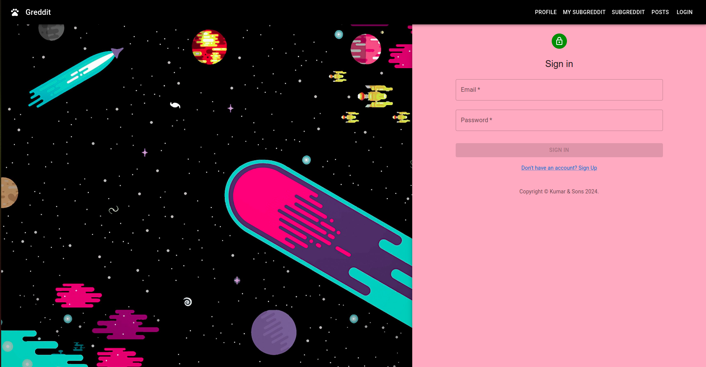
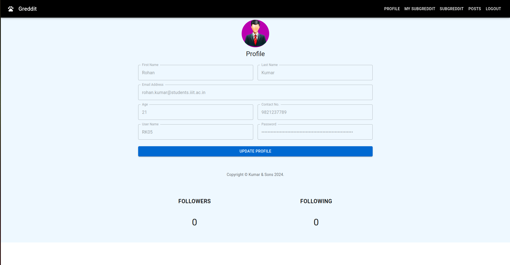
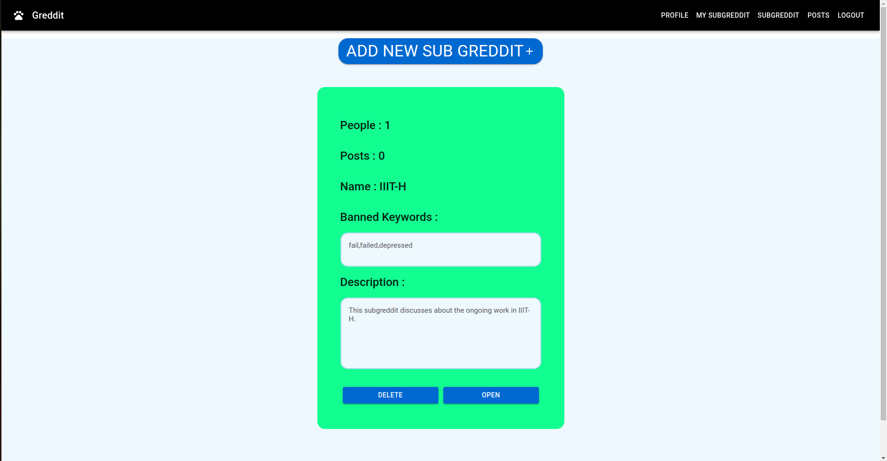
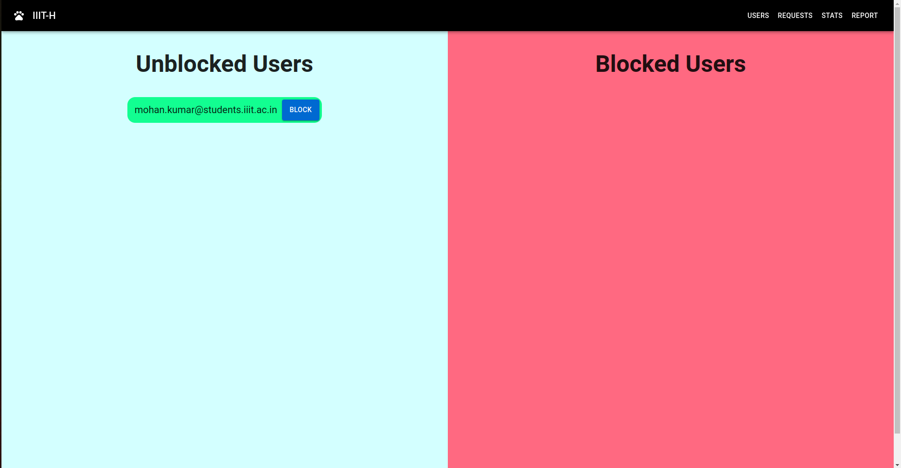
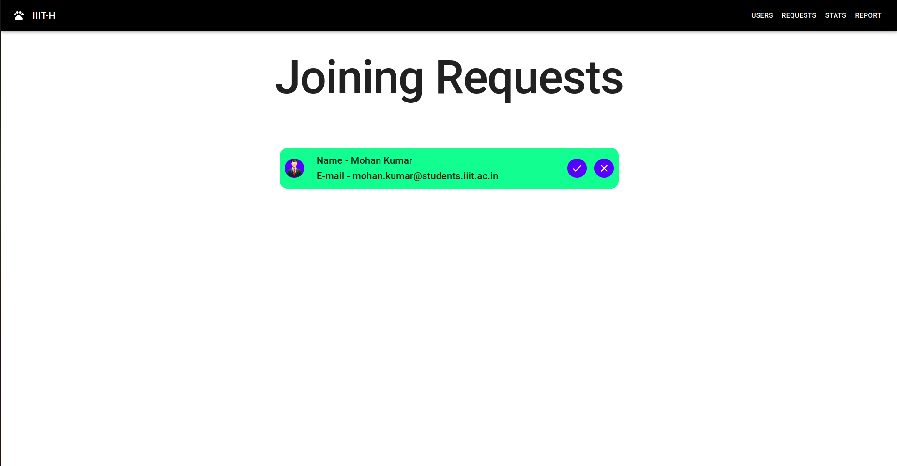
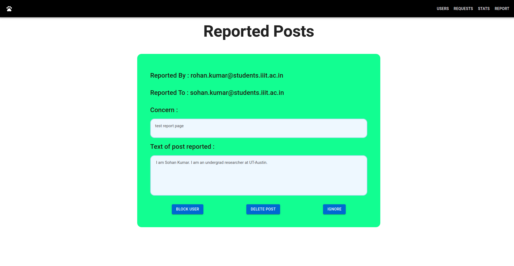
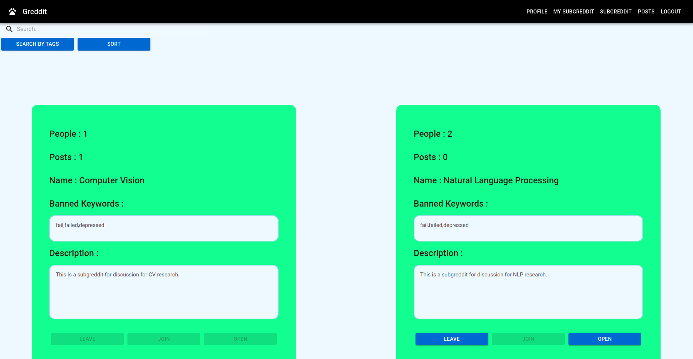
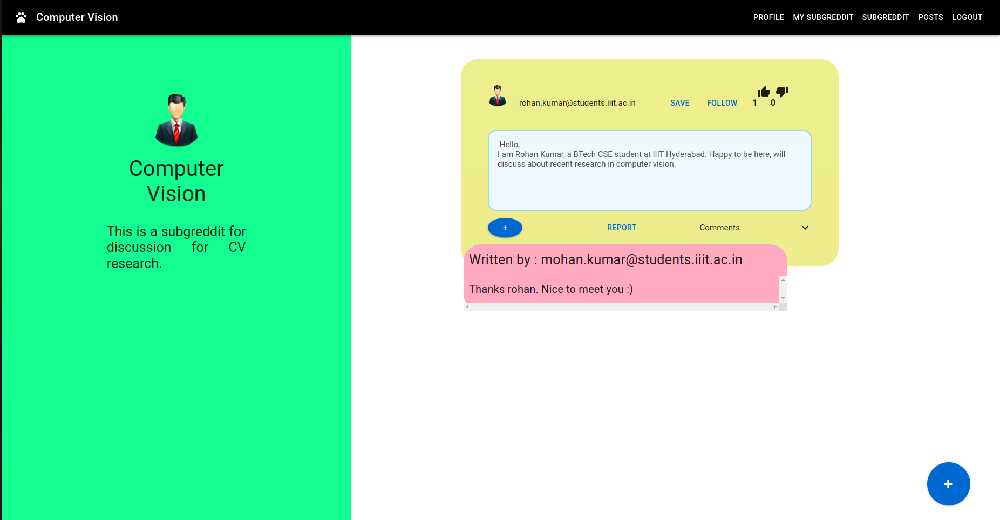

# G-Reddit : Reddit Clone
## Installation and Setup
- Run `npm install` to install all the dependencies.
- For frontend , run `npm start` (Runs on port 3000 by default)
- For backend , run `node server.js` (Runs on port 4000 by default)

** **
## Features of the Application

### Login and Registration
1. A registration page and login portal for the users.
2. Logout option.
3. Authentication & Authorization of the details of the user using JWT Web Token.

</img>
**  **

<b> Note: Assumed that email is unique. and the user will be logged in through email. </b>

** ** 
```Upon login the user is redirected to main page. Links to  various other pages are provided in the navbar.```    

**  **
### Profile Page
1. Contains basic details of the user with an option to edit the profile details. It does an internal validity before sending the data to the DB for storage.
2. A list of followers and followings displayed (Followers and Following)
3. User is able to delete the followers or followings by clicking on the delete icon beside the name of the follower. 
(and user is also able to Unfollow another user)

</img>

** ** 

### My Sub Greddits Page
1. Users can create a new Sub Greddit.
2. A newly created Sub Greddit has 1 follower by default, the creator itself.
3. The page consists of list of all the existing Sub Greddits (of which the user is moderator).
4. Each Subgreddit card contains all the details related to the Subgreddit.
5. A user can also avail the `DELETE` button to delete the Subgreddit with all the data. 
6. It contains an `OPEN` button which has the following features : 
    - Blocked / Unblocked user list.
    - Joining requests acceptance/rejection page.
    - Reported page (The user report page).
    - Stats page (Working on the it :))

** ** 
</img>

** ** 
### Users Page
1. Shows the list of users which are blocked and unblocked by the moderator.
2. Provides facility to change their status.
** ** 
</img>

** ** 

### Joining Requests Page
1. Shows a list of all the interested users. 
2. You can either accept their connection request or reject it.
** ** 

</img>

** **
### Reported Page
1. Contains all the reports that have been
made so far on the Subgreddit with all the related details.
2. Option to block the user 
- implemented the button with 5 sec timer.
- if `BLOCKED` the name of the person who posted is now replaced with the name of “Blocked User”. 
- The moderator of Subgreddit will still see the original name when viewing the list of Reports.
3. Provides facility for moderator to delete the post in the Subgreddit.
4. Ignore the reported post will fade out other buttons.
** ** 
</img>
** **
### Sub Greddits Page
1. The page consists of list of all the existing Subgreddits.
2. The page consists Search Bar, where one can search for a Subgreddit based upon its name.
3. Implemented a filter based on the tags of the Subgreddit.
4. Implemented Sort based on
- Name
- Followers
5. The page gives priority to the joined Subgreddits in display ranking. 
6. For these joined Subgreddits their is a `LEAVE` Button, clicking on which will immediately stop user's access.
- Once a user leaves a Subgreddit you cannot send a join request to that Subgreddit again.
- If the current user is the moderator of that Subgreddit, then `LEAVE` button is disabled.
** ** 
</img>
** **
```On clicking a sub Greddiit, the user is redirected to a page where on the left side their is an Image, Name, Description associated with the clicked Sub Greddiit. ```
** ** 

### User created specific Sub Greddit Page
1. `Create Post (+)` button to create `POST` in posts page.
2. Contains all the posts from the creation. (Only Text Posts for now :))
3. Posts contain the following features
- `Upvoting` and `Downvoting` facility for the post.
- `Comments` facility for the post.
- `SAVE` button for the viewer to save the post for later reference.
- `FOLLOW` button, wherein a user can follow the user who posted that specific post.
4. While creating a post, if the post `BANNED` words (Words which were added by the moderator when the Subgreddit was being created), then an alert is popped with the message that the post contains banned keywords.
** ** 

### Saved Post Page
1. It contains all the posts that have been saved by the logged in user.
2. Provides facility to remove the post from the saved collection.
** ** 

 </img>
** **
 </img>
** **
### Notes:
1. This application has an internal input validation.
2. Tags and Banned keywords need to be entered in a `comma-seperated format` (without space) .
3. When a specific page related to Subgreddit is opened url is changed with its identifier.
4. Improvement in progress to make it more robust !
** ** 


## Thank you for reading it up ! Hope you liked the website.
